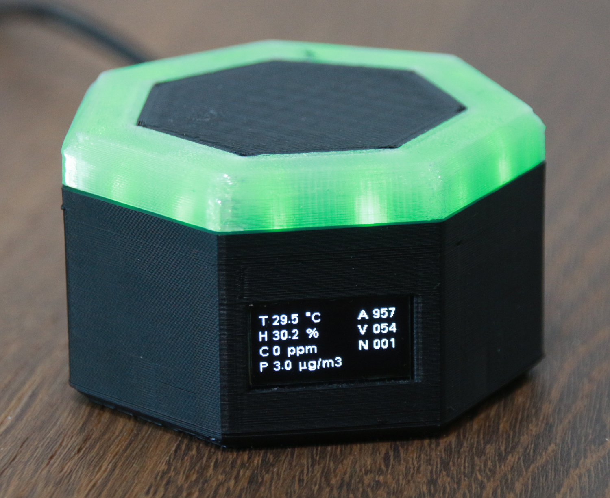
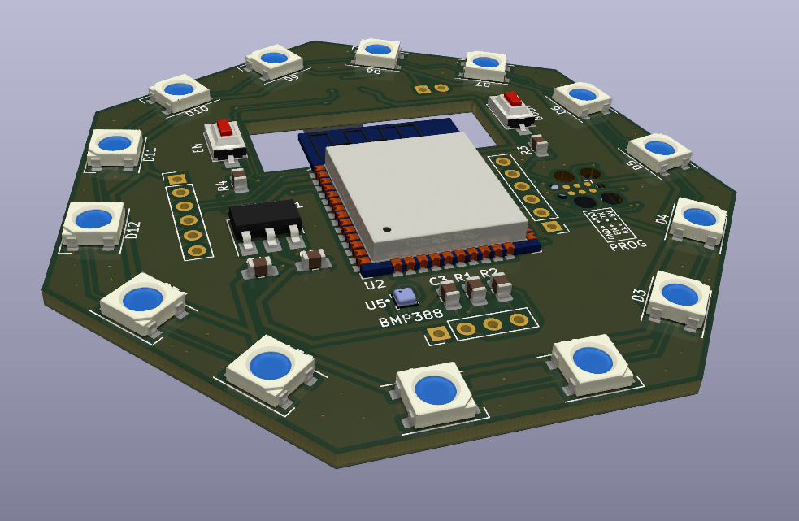

# Septa Sense

Septa Sense in an Open Source and Open Hardware IoT air quality sensor, based on an ESP32 running ESPHome. It features a rim of RGB-LEDs around the top which indicate the quality of the air. Measurements can be seen either on in the integrated display or over Home Assistant. The unit is powered with a USB-C plug on the backside.

## Capabilities
- Temperature (0 - 50°C ± 0.5°C)
- Humidity (0 - 100% ± 4.5%)
- VOC (1 - 500 Index ± 5 Index)
- NOx (1 - 500 Index ± 10 Index)
- Particulate Matter (0 - 1000 μg/m³ ± 10%)
- CO2 (400 - 5000 ppm ± (40 ppm + 5%))
- Pressure (300 - 1250 hPa ± 0.5 hPa)

### Sensors
- [SEN55](https://sensirion.com/products/catalog/SEN55/)
- [SCD41](https://sensirion.com/products/catalog/SCD41/)
- [BMP388](https://www.bosch-sensortec.com/products/environmental-sensors/pressure-sensors/bmp388/)

## Mainboard

The mainboard is a custom PCB which holds the ESP32 chip, the BMP388 and SCD41 sensors and the RGB LEDs. The SEN55 sensor and the display are connected to it with a cable that is directly soldered to the board. It gets power via the USB-C plug over a cable with a JST XH connector that is mounted on the PCB.

## 3D-Print

The case consists of 5 different 3D printed parts. Recommended print settings are:

- Case Bottom
  - Layer height: 0.2 mm
  - Infill: 10 %
  - Support: Yes
  - Support overhang: 80°
- Case Top
  - Layer height: 0.2 mm
  - Infill: 10 %
  - Support: No
- LED Ring
  - Layer height: 0.2 mm
  - Infill: 20 %
  - Support: No
- SEN55 Bracket
  - Layer height: 0.1 mm
  - Infill: 20 %
  - Support: No
- Display Fixture
  - Layer height: 0.2 mm
  - Infill: 20 %
  - Support: No

## BOM
- 1x [Mainboard](#mainboard)
- 1x [SEN55](https://sensirion.com/products/catalog/SEN55/)
- 1x [SCD41](https://sensirion.com/products/catalog/SCD41/)
- 1x Display [SD1306 128x64](https://www.aliexpress.com/item/32638662748.html)
- 1x [USB-C Connector](https://www.aliexpress.com/item/1005001714874457.html)
- 1x Micro JST GH 6 pin Cable
- 1x JST XH 2 Pin Cable
- 1x Dupont Female 4 pin Cable
- 2x M3x5,7-OD 4,6 heat inserts
- 2x M3x10 countersunk screws
- 1x [Set of 3D-Prints](#3d-print)